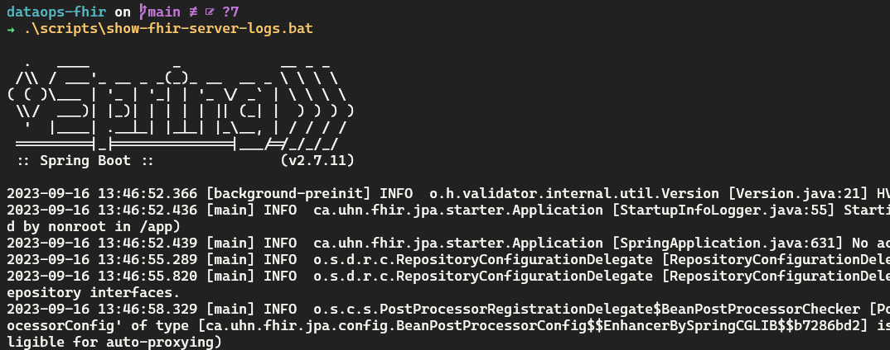

# DataOps FHIR


## :fire: Configuração do Servidor FHIR

Nesta etapa do projeto, vou explicar como preparei o servidor FHIR em meu ambiente local utilizando o [HAPI FHIR](https://hapifhir.io) que é uma solução de código aberto que implementa completamente a especificação HL7 FHIR e disponibiliza um módulo para a implantação de um servidor FHIR.

### :rocket: Preparando o Ambiente

Antes de começar, certifique-me de ter o Docker instalado em minha máquina.

### :whale: Docker Compose

#### 1. FHIR Server

Criei um arquivo `docker-compose.yml` e defini o serviço FHIR nele. Utilizei a imagem [hapiproject/hapi:latest](https://hub.docker.com/r/hapiproject/hapi), que contém todas as dependências e configurações necessárias para o servidor FHIR. Expus a porta 8080 para permitir a comunicação com a API do FHIR Server e também configurei o mapeamento dos arquivos de configuração.

```yaml
    fhir:
        container_name: fhir-server
        image: "hapiproject/hapi:latest"
        ports:
            - "8080:8080"
        configs:
            - source: hapi
              target: /app/config/application.yaml
        depends_on:
            - db
```
#### 2. Banco de Dados

Por padrão, o servidor FHIR usa o banco de dados H2. No entanto, desejei usar o PostgreSQL e, para isso, segui as etapas abaixo:

- Criei um serviço para o banco de dados no arquivo `docker-compose.yml`. Defini variáveis de ambiente para configurar as credenciais de acesso e expus a porta 5432 para permitir o acesso ao SGBD. Também configurei um volume para persistência de dados do container.

```yaml
    db:
        container_name: fhir-db
        image: "postgres:latest"
        restart: always
        ports:
            - "5432:5432"
        environment:
            POSTGRES_PASSWORD: admin
            POSTGRES_USER: admin
            POSTGRES_DB: hapi
        volumes:
            - ./.docker/hapi.postgress.data:/var/lib/postgresql/data
```

#### 3. Conexão FHIR Server e Postgres

Para que o servidor FHIR utilizasse o PostgreSQL, adicionei a seguinte configuração ao arquivo `./.docker/conf/hapi.application.yaml`:

```yaml
spring:
  datasource:
    url: 'jdbc:postgresql://db:5432/hapi'
    username: admin
    password: admin
    driverClassName: org.postgresql.Driver
  jpa:
    properties:
      hibernate.dialect: ca.uhn.fhir.jpa.model.dialect.HapiFhirPostgres94Dialect
      hibernate.search.enabled: false
```

### :page_facing_up: Scripts

Para facilitar a observação do servidor FHIR, criei um script no path `./scripts/show-fhir-server-logs.bat`. Este script permite verificar os logs do servidor de maneira conveniente.



## :rocket: Execução da Carga de Dados Para o FHIR

Para execução do ambiente desenvolvido, utilizei o Docker Compose para orquestrar três serviços: **app**, **fhir**, e **db**. O serviço **app** executa uma aplicação Python que se conecta ao servidor FHIR, enquanto **fhir** é o servidor FHIR e **db** é o banco de dados PostgreSQL.

O seguinte comando é utilizado para iniciar os serviços:

```bash
docker-compose up -d
```

## :globe_with_meridians: Tecnologias Utilizadas

- Spark
- Python
- HAPI FHIR